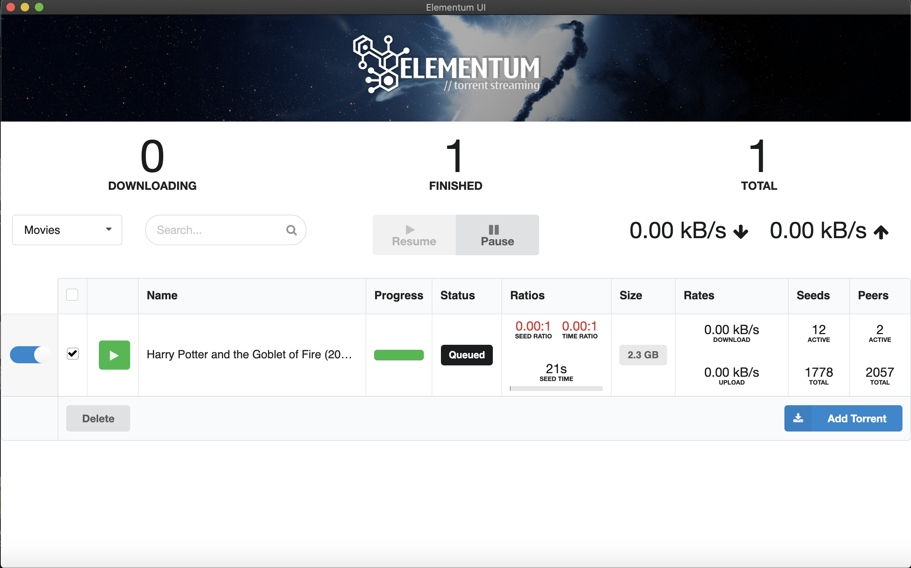

# Description

Cross-platform (MacOS, Windows, Linux) electron-powered desktop [Elementum](https://github.com/elgatito/plugin.video.elementum) application.

Smooth scrolling, caches locally your account information. Enjoy!

Exists solely because of [Natifier](https://github.com/jiahaog/nativefier).

# Requirements

-   `Node.js` >= 12.13.0
-   `npm` >= 6.9.0

# How to build for your system

You have to know your desired Electrum server URL and use it to compile. Example is `http://192.168.1.29:65220/web/`.

#### 1) `ELECTRUM_URL="YOUR_ELECTRUM_URL" npm run bootstrap` (Example: ELECTRUM_URL="http://192.168.1.29:65220/web/" npm run bootstrap)

#### 2) Extract binary from generated `./bin` folder and install as ordinary binary

## Interface:

